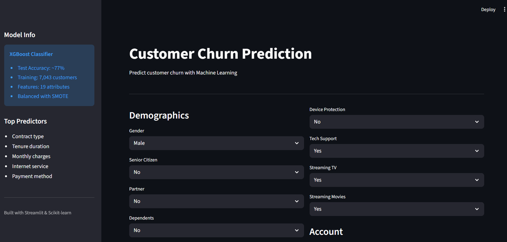

##🔥Customer Churn Prediction


A sleek, production‑ready **Customer Churn Prediction** web app built with **XGBoost + Streamlit**. Designed to be fast, intuitive, and recruiter‑friendly — perfect for demos, portfolios, and real‑world use.

---

## 💣 About This Project

* ⚡ **Real‑time predictions** with confidence & risk level
* 🧠 **XGBoost Classifier** trained on 7,000+ customers
* ⚖️ **SMOTE‑balanced data** for fair learning
* 🎛️ **Interactive UI** (no boring forms)
* 📊 **Visual probability charts** (Plotly)
* 💼 **Portfolio‑ready** (clean code + clean UX)

---

## 🧪 Model & ML Decisions 

* **Algorithm:** XGBoost Classifier
* **Accuracy:** ~77%
* **Features:** 19 customer attributes
* **Target:** Churn (Yes / No)

### 🔮 Top Predictors

* Contract Type
* Tenure
* Monthly Charges
* Internet Service
* Payment Method

---

## 🖼️ App Screenshots 


```
/screenshots
 ├─ home.png
 ├─ form.png
 ├─ prediction.png
 └─ probabilities.png
```

### Example

```md
## Screenshots




---

## 🛠️ Tech Stack 

* **Python 3.11**
* **Streamlit** – UI & deployment
* **XGBoost** – ML model
* **Scikit‑learn** – preprocessing & metrics
* **Imbalanced‑learn (SMOTE)** – class balancing
* **Plotly** – interactive charts
* **Joblib** – model persistence

---

## 🚀 Run Locally 

### 1️⃣ Clone the repo

```bash
git clone https://github.com/your-username/customer-churn-prediction.git
cd customer-churn-prediction
```

### 2️⃣ Create & activate virtual environment

```bash
python -m venv venv
venv\Scripts\activate   # Windows
# source venv/bin/activate  # macOS/Linux
```

### 3️⃣ Install dependencies

```bash
pip install -r requirements.txt
```

### 4️⃣ Run the app

```bash
streamlit run churn_app.py
```

Open 👉 `http://localhost:8501`

---

## 📦 Project Structure

```
CUSTOMER-CHURN/
│
├─ churn_app.py              # Streamlit app
├─ customer_churn_model.pkl  # Trained model
├─ churn_encoders.pkl        # Label encoders
├─ requirements.txt
├─ screenshots/
└─ README.md
```

---

## 🎯 Business & Placement Use Cases

* 📈 Customer retention strategy
* 💡 Business decision support
* 🎓 ML / Data Science portfolio project
* 🧪 Rapid churn experimentation

---

## 🌐 Live Demo (Deployed on Streamlit Cloud)

1. Push this repo to GitHub
2. Go to **streamlit.io → Deploy app**
3. Select `churn_app.py`
4. Done. Your app is live 🚀

---

## 🧠 Future Improvements

* SHAP explanations
* Model comparison dashboard
* User authentication
* Database logging

---

## 👑 Author & Ownership Statement

**Prathmesh Bunde**
Computer Science | ML | FinTech

> *Built to impress. Optimized to perform.*

---

⭐ **If you like this project, star the repo. If you love it, fork it.**
